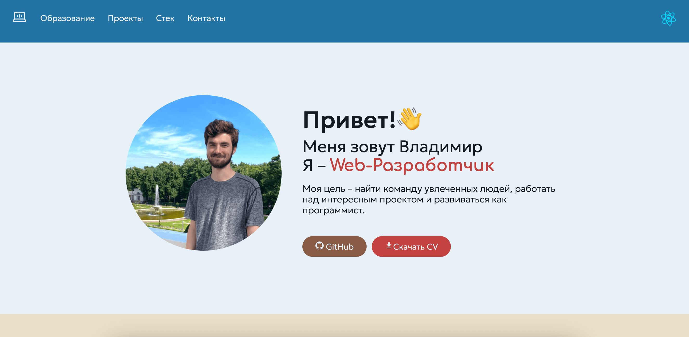
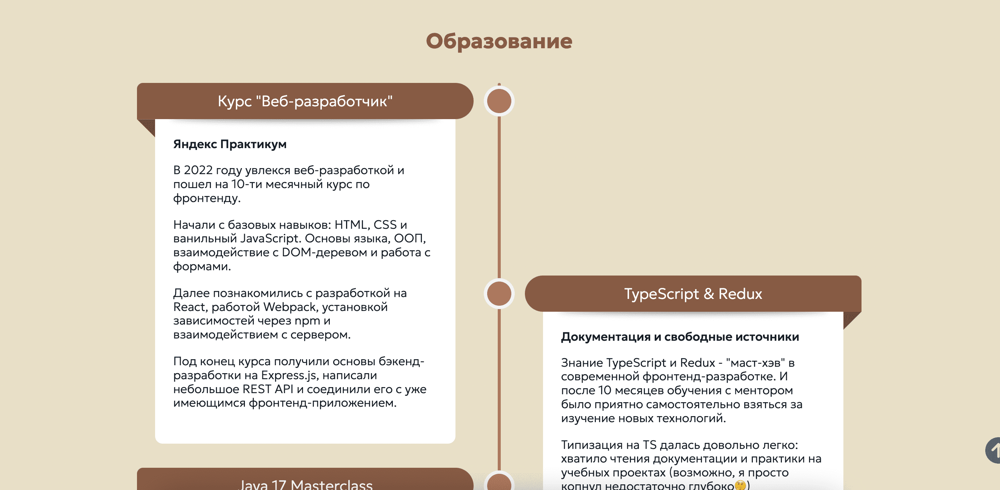
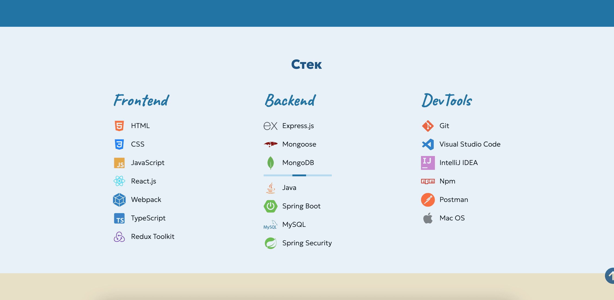

## Сайт-Портфолио

Данный проект предназначен для личного использования в качестве наглядного резюме с примерами реализованных проектов.

Демо сайта --> **[DEMO](https://vova-pol.github.io/portfolio/)**

### Превью


_Приветствие / О себе_


_Образование_


_Стек_

### Файловая структура

```
└── src
    ├── components
        ├── ComponentOne
            ├── ComponentOne.js
            └── ComponentOne.css
        └── ComponentTwo
            ├── ComponentTwo.js
            └── ComponentTwo.css
    ├── hooks
    ├── images
    ├── utils
    ├── vendor
    ├── index.css
    └── index.js
```

### Контент

- Приветствие / О себе
- Образование
- Проекты
- Стек
- Форма обратной связи
- Контакты

### Функционал

&#128223; Открыть GitHub автора\
&#128221; Скачать резюме\
&#129299; Ознакомиться с проектами (demo + код)\
&#128233; Отправить письмо через форму связи

### Как развернуть локально

1. Склонировать репозиторий

```
git clone https://github.com/Vova-Pol/portfolio.git
```

2. Установить зависимости

```
npm i
```

3. Запустить проект

```
npm run start
```

4. Готово! Проект работает локально по адресу http://localhost:3000/portfolio
